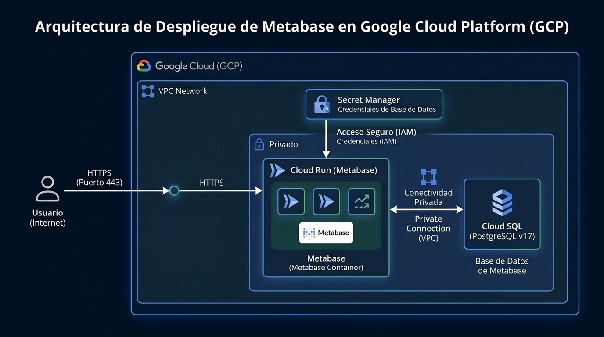

# Deploying Metabase securely, serverless, and cost-effectively on GCP with Terraform

This repository contains the Infrastructure as Code (IaC) configuration in Terraform to deploy a secure, scalable, and low-cost **[Metabase](https://www.metabase.com/)** instance on GCP using serverless services.

This architecture is inspired by real production deployments but optimized and simplified to minimize operational and maintenance costs.

### Why use Terraform?
Managing cloud infrastructure manually through a web console is prone to human error, difficult to replicate, and hard to track over time. By using **[Terraform](https://www.terraform.io/)** (Infrastructure as Code), we ensure that this entire architecture is deployed consistently, can be version-controlled alongside your application, and can be safely completely destroyed with a single command to avoid unexpected costs.

---

## Architecture

The infrastructure consists of the following components:



### Key Features and Innovations
*   **Serverless Compute (Cloud Run):** Runs the official Metabase image (`metabase/metabase:v0.62.4`) with automatic instance scaling (scaling to 0 when not in use to save costs).
*   **Private Database (Cloud SQL):** Managed PostgreSQL 17 instance configured **exclusively with a private IP**, ensuring the metadata database is never exposed to the internet.
*   **Direct VPC Egress (Modern):** Cloud Run connects directly to the VPC without needing the expensive and inefficient *Serverless VPC Access Connector* from previous generations, reducing the monthly fixed cost for the connector to $0.
*   **Optimized Egress (PRIVATE_RANGES_ONLY):** Only traffic towards the private network (Cloud SQL) passes through the VPC. Internet queries (like BigQuery, external APIs, or AI integrations) go directly over the public Cloud Run network, **eliminating the need to pay for a Cloud NAT and Cloud Router** (saving ~$30-40 USD monthly).
*   **Security:** Database credentials are securely stored in **Secret Manager** and injected into Cloud Run as environment variables upon startup.
*   **Dynamic IPs:** The database host (`MB_DB_HOST`) is dynamically detected from the resource created in Terraform, eliminating hardcoded IPs.

## Prerequisites

1.  **Google Cloud SDK** installed and authenticated with your account:
    ```bash
    # Login with your account
    gcloud auth login hello@myfriend.com

    # Ensure it is active
    gcloud config set account hello@myfriend.com
    ```
2.  **Terraform** (version `>= 1.5.0`).
3.  An active GCP project associated with your account.

---

## Quick Deployment

### 1. Prepare GCP Authentication
Make sure to log in with the correct GCP account and project:
```bash
gcloud auth login
gcloud config set project "your-gcp-project-id"
```

### 2. Enable required GCP services
Enable the necessary GCP APIs for the infrastructure:
```bash
gcloud services enable \
    compute.googleapis.com \
    sqladmin.googleapis.com \
    run.googleapis.com \
    secretmanager.googleapis.com \
    servicenetworking.googleapis.com \
    --project="your-gcp-project-id"
```

### 3. Create the Database Secret in Secret Manager
To avoid saving passwords in local files in plaintext, we generate and store the database password directly in Secret Manager:
```bash
# Create the secret
gcloud secrets create metabase-db-password --replication-policy="automatic" --project="your-gcp-project-id"

# Generate a secure random password and save it in the secret
openssl rand -base64 24 | tr -d '\n' | gcloud secrets versions add metabase-db-password --data-file=- --project="your-gcp-project-id"
```

### 4. Create the GCS Bucket for Terraform State
Terraform needs a place in the cloud to store the infrastructure state. Create a bucket in your project (the name must be globally unique, e.g., using your project ID):
```bash
gcloud storage buckets create gs://your-gcp-project-id-terraform-state --location=us-central1
```

### 5. Configure local variables (`terraform.tfvars` and `backend.tfvars`)
Create a file named `terraform.tfvars` (ignored by Git) to define your project and region:
```hcl
project_id = "your-gcp-project-id"
region     = "us-central1"
```

Create a file named `backend.tfvars` (ignored by Git) to dynamically and privately specify your GCS bucket for the remote state:
```hcl
bucket = "your-gcp-project-id-terraform-state"
```

### 6. Configure the State Backend (GCS)
To avoid exposing your personal bucket name in the public repository, the `backend "gcs"` block in `terraform/provider.tf` does not have the `bucket` field defined. This is configured dynamically by reading your local `backend.tfvars` file during initialization.

### 7. Run Terraform
Initialize the backend, check the plan, and apply the configuration from within the `terraform` directory:

```bash
cd terraform

# Initialize providers and configure the remote backend
terraform init -backend-config=backend.tfvars

# View the execution plan
terraform plan

# Apply changes and deploy
terraform apply
```

Upon completion, Terraform will display the `metabase_url` in the terminal. Click on it to access the initial setup wizard of your new Metabase.

---

## From POC to Production

This simplified design is ideal as a **Step 1 (POC)** to validate Metabase and create initial reports at the lowest possible cost. However, to transition this infrastructure to a formal enterprise production environment, you should incorporate the following additional modules and infrastructure:

### 1. Availability and Performance
*   **`min_instance_count = 0` for test environments:** The repository code is configured with `min_instance_count = 1` to guarantee immediate response. If you lower it to `0`, the container will shut down when not in use, and the first access of the day will take 10-15 seconds (cold start). Useful only in test environments where cost matters more than latency.
*   **Memory Adjustments:** If you have more than 10 concurrent users or very heavy dashboards, increase the Cloud Run memory to 8GB and set `JAVA_OPTS = "-Xmx6g"`.

### 2. Network and External Connectivity (Cloud NAT)
*   If your data sources are outside GCP (such as staging or production transactional databases hosted on other providers or on-premise servers) and they **require you to declare a static source IP in their whitelist/firewall**, you will need to:
    1. Change the Cloud Run egress configuration to `egress = "ALL_TRAFFIC"`.
    2. Create a **Cloud Router** and a **Cloud NAT** associating one or two GCP static IP addresses to it.
    *This adds about $30 USD monthly to the budget, but allows Metabase to securely connect to any external database.*

### 3. Advanced Security and Corporate Domain
*   **SSL Domain Mapping:** Instead of using the `xxxx.run.app` URL, map your own domain (e.g., `data.mycompany.com`). Cloud Run allows you to do this directly and automatically in several regions.
*   **HTTPS Load Balancer and Cloud Armor:** It is recommended to place an external HTTP(S) Load Balancer in GCP. This allows you to:
    *   Enable **Cloud Armor** as a Web Application Firewall (WAF) to block SQL injection attacks or DDoS.
    *   Restrict direct access to Cloud Run (blocking the native URL) to force all traffic through the load balancer.
*   **IAM and Authentication:** Remove the `allUsers` public permission from Cloud Run and use the Load Balancer along with **Identity-Aware Proxy (IAP)** to require users to log in with their corporate Google Workspace (IAM) accounts before even seeing the Metabase login screen.

### 4. Database Resilience
*   **Backups and High Availability:** Ensure that Cloud SQL automatic backups are active daily with a retention of at least 7 days. If your organization operates 24/7, consider enabling the *High Availability* (HA) option in Cloud SQL (adds a secondary database in another availability zone).

---

## ⚠️ Important: Cleanup and Cost Prevention
If you are deploying this as a Proof of Concept (POC) or test, **you must delete all resources once you are done**. Leaving resources active (especially Cloud SQL) will incur ongoing monthly costs on your billing account.

### What needs to be deleted?
1. **Terraform Managed Resources:** (Cloud SQL instance, Cloud Run service, VPC, Subnets, IAM roles).
2. **Manually Created Resources:** (GCS State Bucket and Secret Manager secrets).

To safely tear down the environment, navigate to the `terraform` directory and run the following commands:

```bash
cd terraform

# 1. Destroy all Terraform managed resources
terraform destroy

# 2. Delete the manually created secret
gcloud secrets delete metabase-db-password --project="your-gcp-project-id" --quiet

# 3. Delete the Terraform state bucket
gcloud storage rm -r gs://your-gcp-project-id-terraform-state
```
